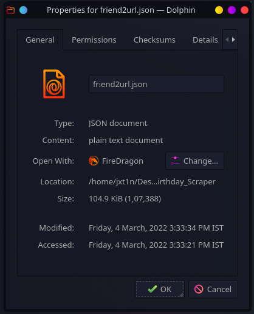
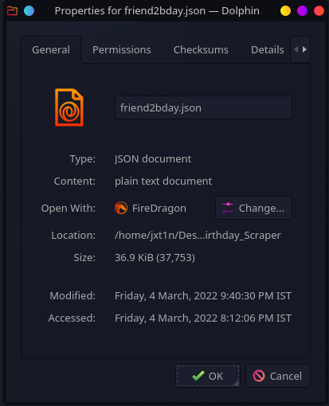

# Code to scrape birthdays of friends from Facebook

Random Project for testing automation and scraping skills using undetected_chromedriver (Selenium) and BeautifulSoup. 

Note: Some work to be done as facebook rate limits the number of requests per day. 
- Functions are implemented and tested to work on all profiles. 

Extraction of profile url for each friend is successfully implemented and tested upto 1800 profiles. ~~Facebook starts to block requests when opening each profile so the maximum number of birthdays scraped at once is 80 for now. Will test more combinations of waiting times.~~  
**UPDATE**: The new code works with 1500 profiles with no rate limit or blocks on facebook's end.

Setting up .py files still remains to be done.

```
PehliKoshish.ipynb  # This notebook contians the preliminary codes i tried to implement. XD

Finalised-stuff.ipynb # This notebook contians the final code blocks for now. :3

```

Required python packages: 
- Selenium
- Undetected-chromedriver
- BeautifulSoup4

Windows:

```
pip install -r requirements.txt
```

Linux/Mac:

```
pip3 install -r requirements.txt
```


## What next? 

- Will finalise the codes and convert them to .py files for easier use.
- Write demo use cases for the code like uploading them to google calendar.


## Output Screenshots





***Outputs of each cell are removed for privacy reasons.***
